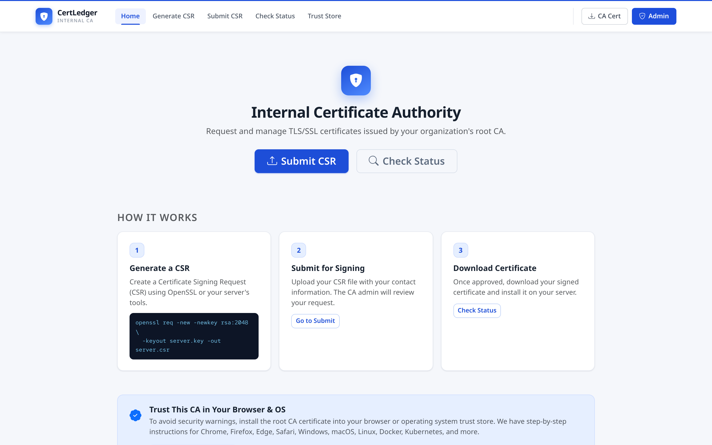
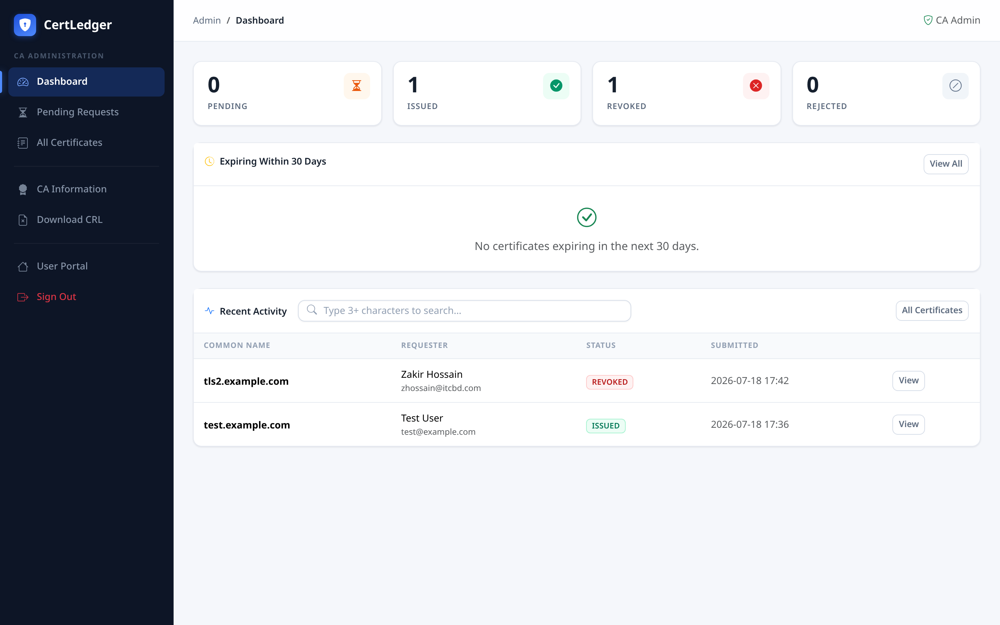
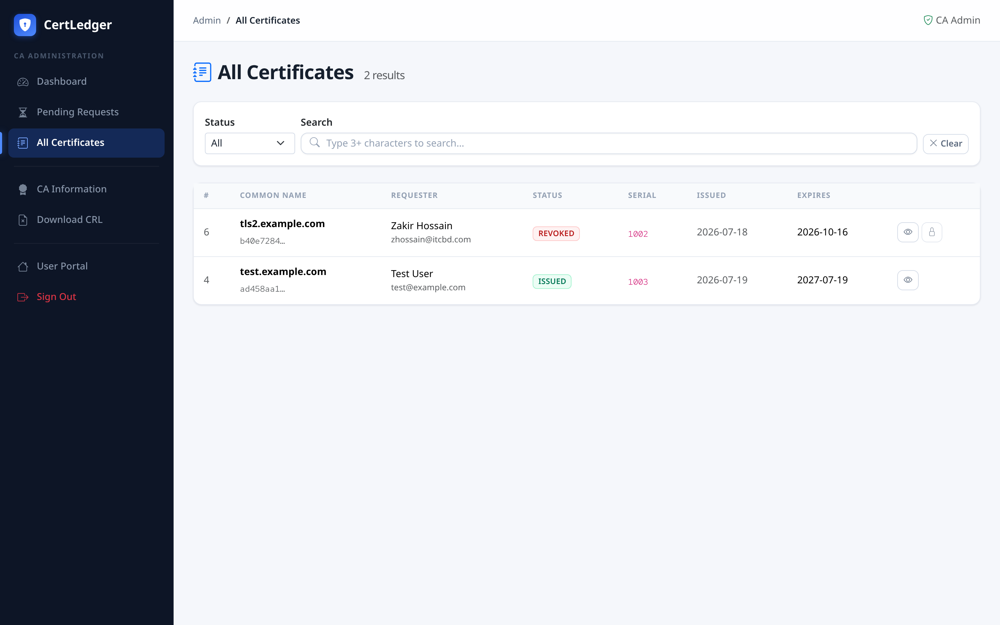
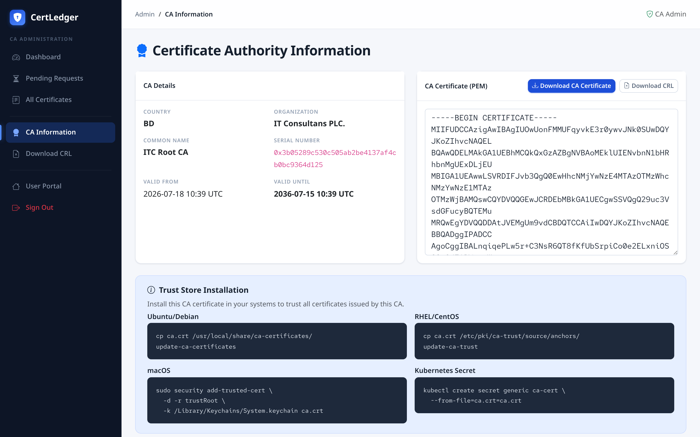
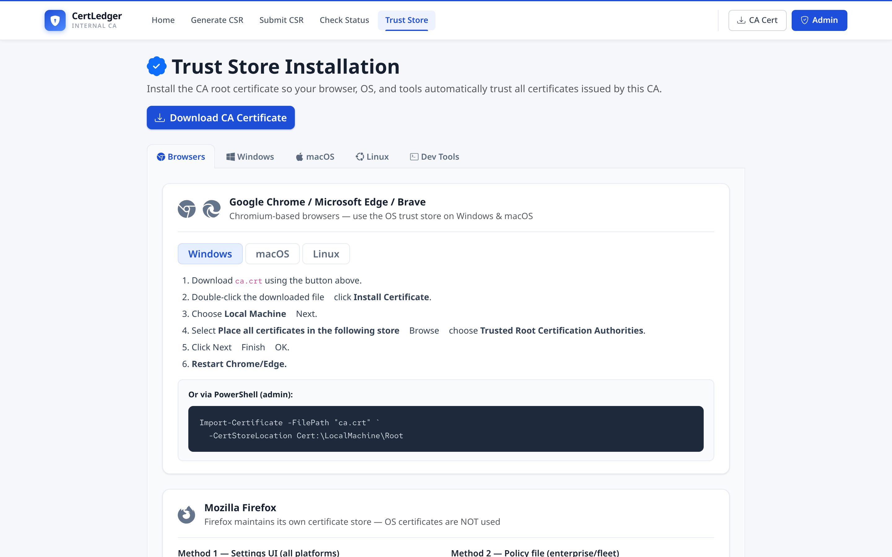

# CertLedger

[](LICENSE)


An internal **Certificate Authority (CA)** web application for issuing and managing TLS/SSL certificates for your organization. Users submit Certificate Signing Requests (CSRs) through a self-service portal; an administrator reviews, signs, revokes, and manages them from an enterprise-styled admin panel.

Built with **FastAPI + PostgreSQL + Bootstrap 5**, deployed as a 4-service Docker Compose stack behind an nginx TLS reverse proxy.

---

## Features

- **Self-service portal** — generate a CSR in-browser, submit it, and track status by tracking ID or by name/email search.
- **Admin review workflow** — dashboard with live stats, pending-request queue, sign / reject / revoke actions, and a full certificate ledger.
- **Certificate lifecycle** — issue signed certificates, revoke with a reason, and publish a Certificate Revocation List (CRL).
- **Record deletion** with safety guards:
  - **Pending** and **rejected** requests can be deleted at any time (never issued, not on the CRL).
  - **Revoked** certificates can only be deleted **after they expire** — removing one earlier would silently drop it from the CRL and un-revoke it.
  - **Issued** certificates can never be deleted (must be revoked first).
- **Trust Store guide** — step-by-step CA installation instructions for browsers, Windows, macOS, Linux, and dev tools (Docker, Kubernetes, curl, Python, Node, Git, Java, OpenSSL).
- **Enterprise UI** — a cohesive "Refined Slate & Blue" theme across the whole site, button-less live search (type 3+ characters), and premium form controls.

---

## Screenshots

| User Portal | Admin Dashboard |
|:---:|:---:|
|  |  |
| **All Certificates** | **CA Information** |
|  |  |

**Trust Store installation guide**



---

## Architecture

The stack runs as four Docker services:

| Service | Image / Build | Role |
|---|---|---|
| `frontend` | `./frontend` (nginx) | TLS termination, HTTP→HTTPS redirect, reverse proxy to the backend. Exposes ports **80** and **443**. |
| `backend` | `./backend` (FastAPI/uvicorn) | Application server — templates, CA operations, and REST endpoints. |
| `database` | `postgres:16-alpine` | Persistent storage for certificate requests. |
| `certificate` | `./certificate` | One-shot init container that generates the nginx self-signed TLS cert on first run, then exits. |

**Tech stack:** FastAPI · SQLAlchemy · PostgreSQL 16 · `cryptography` for CA/CSR/CRL operations · Jinja2 templates · Bootstrap 5.

---

## Quick start

**Prerequisites:** Docker and Docker Compose.

```bash
# 1. Clone
git clone git@github.com:zakirpcs/CertLedger.git
cd CertLedger

# 2. Configure environment
cp .env.example .env
# then edit .env and set a strong ADMIN_PASSWORD and SECRET_KEY

# 3. Launch
docker compose up -d --build
```

Then open **https://localhost** (the TLS cert is self-signed, so your browser will show a one-time warning).

- **User portal:** https://localhost/
- **Admin panel:** https://localhost/admin/login

On first login the admin is guided through a one-time CA setup (common name, organization, country, validity).

---

## Configuration

Environment variables (see `.env.example`):

| Variable | Required | Description |
|---|---|---|
| `ADMIN_PASSWORD` | ✅ | Password for the admin panel. |
| `SECRET_KEY` | ✅ | Long random string used to sign admin session tokens. |
| `DB_PASSWORD` | optional | PostgreSQL password (defaults to `certledger`). |

> ⚠️ `.env` holds secrets and is git-ignored — never commit it. Only `.env.example` is tracked.

---

## Usage

### User flow
1. **Generate CSR** (`/generate`) — create a key + CSR in the browser, or use your own OpenSSL command.
2. **Submit CSR** (`/submit`) — upload the CSR with your contact details; receive a tracking ID.
3. **Check Status** (`/status`) — look up by tracking ID or search by name/email.
4. **Download** the signed certificate once approved, and install the **CA root** from the **Trust Store** (`/trust`).

### Admin flow
1. **Sign in** at `/admin/login`.
2. **Dashboard** — pending/issued/revoked/rejected counts, certificates expiring within 30 days, and recent activity.
3. **Pending Requests** — review and **sign** or **reject** incoming CSRs.
4. **All Certificates** — filter by status, search, view details, **revoke** issued certs, and **delete** eligible records.
5. **CA Information** — view CA details, download the CA certificate (`/ca.crt`) and the CRL (`/admin/crl.pem`).

---

## Project structure

```
.
├── docker-compose.yml          # 4-service stack definition
├── .env.example                # config template (copy to .env)
├── frontend/                   # nginx reverse proxy + TLS
├── certificate/                # one-shot self-signed cert generator
├── database/                   # Postgres init SQL
└── backend/
    ├── app/
    │   ├── main.py             # FastAPI app + template config
    │   ├── models.py           # CertificateRequest model, CertStatus enum
    │   ├── ca_ops.py           # CA init, CSR signing, CRL generation
    │   ├── auth.py             # admin session tokens
    │   └── routers/            # user (public) + admin routes
    ├── templates/              # Jinja2 templates (public + admin/)
    └── static/                 # CSS, JS, vendored Bootstrap
```

---

## Development notes

The backend image **bakes in** `templates/` and `static/` (no bind mounts). Editing a template or asset requires a rebuild — a plain `docker restart` will **not** pick up changes:

```bash
docker compose build backend && docker compose up -d backend
```

Static assets are cache-busted automatically via a `static_v` token (computed from the newest file mtime in `static/`), so browsers always fetch fresh CSS/JS after a rebuild.

---

## Security notes

Reviewed against the **OWASP Top 10**. Protections in place:

- **HTTPS everywhere** — HTTP is 301-redirected to HTTPS; **HSTS** enforces it. Self-signed by default — front it with a real certificate in production.
- **Hardened headers** — a restrictive **Content-Security-Policy** (`default-src 'self'`, no external origins, `object-src 'none'`, `frame-ancestors 'self'`), plus `X-Frame-Options`, `X-Content-Type-Options`, and `Referrer-Policy`.
- **Session cookies** are `HttpOnly`, `Secure`, and `SameSite=Lax` (the last mitigates CSRF on state-changing admin actions). Sessions are signed with `SECRET_KEY` and expire after 8 hours.
- **Login brute-force throttling** — 5 failed attempts per IP within 5 minutes triggers a temporary block; passwords are compared in constant time.
- **Fail-closed configuration** — the app refuses to start if `SECRET_KEY` or `ADMIN_PASSWORD` is unset or left at an insecure default.
- **Injection-safe** — all database access is via the SQLAlchemy ORM (parameterized); templates use Jinja2 auto-escaping; download filenames are sanitized to prevent `Content-Disposition` header injection; uploaded CSRs are size-capped and signature-verified.
- The CA private key and issued-certificate data live in the `ca-data` Docker volume — back it up and protect it accordingly.
- Deleting a revoked certificate removes its serial from the CRL, which is why deletion is blocked until the certificate has expired.

> Note: the admin panel is a single shared password (no per-user accounts) and issued certificates carry the SANs requested in the CSR — always review request details before signing.

---

## License

Released under the [MIT License](LICENSE).
